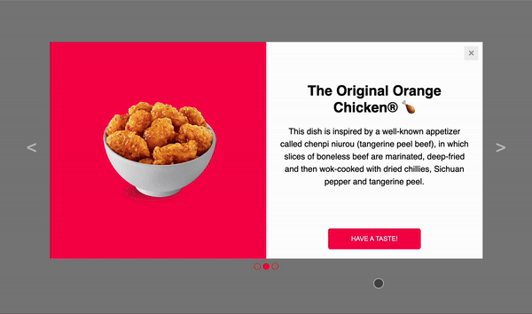

# Responsive Modal with Swipe Navigation & Transitions

Elevate user engagement with a responsive modal component featuring smooth transitions and intuitive swipe navigation. This versatile component seamlessly adapts to various devices and orientations (desktop, mobile landscape, mobile portrait) for a consistent user experience.

[👆VEW MODAL👆](https://hswinata.github.io/responsive_modal/) 

## Features
   

1. **Responsive design**: Ensures optimal user experience on various devices and orientations.
2. **Sliding transitions**: Slides from slide to another with smooth and visually appealing animations.
3. **Intuitive Swipe navigation**: Users can effortlessly navigate slides using left/right swipes on the X-axis.

## Technologies
1. **HTML/CSS**: Used for structuring the modal, styling, and media queries for responsiveness.
2. **JavaScript**:
   The JavaScript code manages the interactive behavior of the modal component, including:
    * **Slide Navigation:**
         
        * Handles user interaction with "next" and "previous" buttons to navigate between slides.
        * Provides functions `activateSlide` and `activateSlideByIndex` for programmatic slide control (optional depending on your implementation).

    * **Dot Navigation:**
         
        * Enables users to switch slides by clicking on the navigation dots.
        * Utilizes functions `activateDot` and `activateSlideByIndex` for synchronization between dots and slides.

    * **Modal Closing:**
        * Listens for clicks on designated close buttons and triggers the `closeModal` function to hide the modal.
          
    * **Touch Interaction (Mobile Devices):**
         
        * Implements swipe gestures for intuitive slide navigation on mobile devices using functions:
            - `handleTouchStart`: Captures the initial touch position.
            - `handleTouchMove`: Tracks touch movement to determine swipe direction.
            - `handleTouchEnd`: Detects the swipe completion and triggers slide transition based on the direction.
